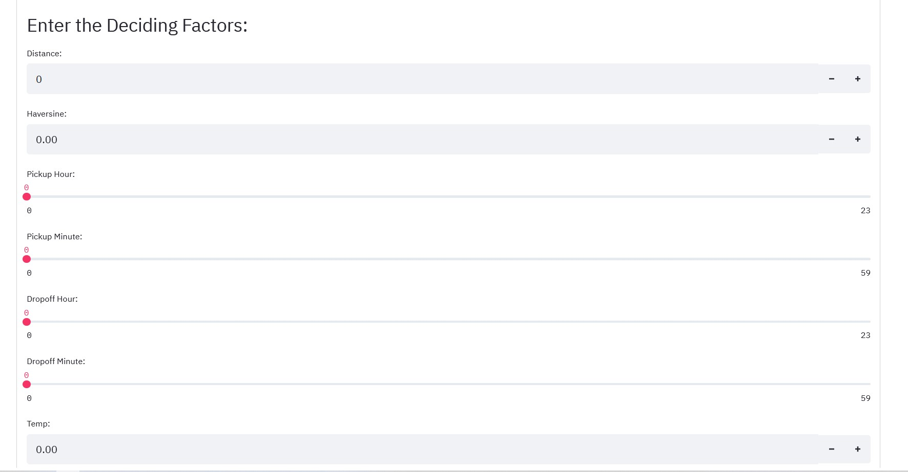

# Seoul bike trip duration prediction
Trip duration is the most fundamental measure in all modes of transportation. Hence, it is crucial to predict the trip-time precisely for the advancement of Intelligent Transport Systems (ITS) and traveller information systems. In order to predict the trip duration, data mining techniques are employed in this paper to predict the trip duration of rental bikes in Seoul Bike sharing system. The prediction is carried out with the combination of Seoul Bike data and weather data. 

- The Data used include trip duration, trip distance, pickup-dropoff latitude and longitude, temperature, precipitation, wind speed, humidity, solar radiation, snowfall, ground temperature and 1-hour average dust concentration. 
## Dataset
The dataset if huge infact it's the first time I worked with more than **9 millions rows**. yes you read it correct.
Download it from [here](https://www.kaggle.com/saurabhshahane/seoul-bike-trip-duration-prediction)

# Production level code
This is more of advanced step of my earlier work [here](https://github.com/AIsquare/Seoul-Bike-Trip-Duration-Prediction). And the goal of this project is to devlop a skeleton that  could be easy to follow and anyone can builtupon that skeleton. The repo above mentioned is a deployed model on heroku with the help of streamlit. 

for feature engineering and EDA look into this folder [](https://github.com/AIsquare/seoul-bike-trip-duration-prediction-deployment/upload/main/research%20and%20development)

### Before you judge this is just a dummy model, for the sake of my learning to understand production code, I have build a rubbish model, feel free to contribute.
## Skeleton
There are many phases of machine learning pipeline and its quite iterative, but as the pioneer say if you are trying to build a model, first try to build the most dumbest model from very little data. A littl data I mean take a sampling of your data. Since I don't have a high end laptop i did the same thing I took a sample and trained on my laptop. Coming back to ML Pipeline

    .
    ├── research and development                # All your jupyter notebook goes here all your differnt model EDA should be researched here
    ├── production-model-package                # This is kind of big deal all your packages and files contains here. Follow the hierarchy.
    |      ├── regression_model
    |            ├──config                      # This is where you declare or define your importannt file paths, and testing modules
    |               __init__.py
    |                core.py
    |            ├──datasets
    |            ├──processing              # This folder contains all your loading data and saving trained model
    |                data_manager.py
    |                features.py            # This where you write your data formation if any.
    |                validation.py           # some final tweaks and finalizing your dataset schema.
    |            ├──trained_models           # This is where your trained model will be stored.
    |            __init_.py
    |            config.yml
    |            pipeline.py
    |            predict.py
    |            train_pipeline.py
    |            VERSION
    |      ├── requirements
    |      ├── tests
    |      setup.py
    |      MANIFEST.in
    |      pyproject.toml
    |      tox.ini                   
    └── README.md
    
Exaplaining each and every module will be a cumbersome, lets keep that for a blog. I would suggest go ahead and explore. There are new libraries that I have learned
while doing this project. i. **Pydantic and tox** these libraries are very good for testing and debugging.

This project is just a small part from a big picture. Stay connected to get more updates on like packaging and REST api etc.

# lets talk about TOX
.tox is generic virutalenv command line test tool.
It means we don't have to worry about different operating system
whether you are working on mac, windows or linux.
- we don't have to worry about setting up python paths, configuring environment variables.
We do all this in tox.ini file.

    > go ahead and install -- pip install tox
- you might face some issues in the beginning on MAX_PATH limitation.
    - To solve follow this link [https://docs.python.org/3/using/windows.html]()
    and open you registry editor and change the variables given in the documentation.
    
For more on Tox read [here](https://christophergs.com/python/2020/04/12/python-tox-why-use-it-and-tutorial/)

# Pytest
I have used Pytest framework makes it easy to write small tests, yet
scales to support complex functional testing for application and libraries.
If you have used Python unittest libraries, this one offers a richer statement during failures,
which makes debugging easier. 

Features:
- Detailed info on failing assert statements (no need to remember self.assert* names)
- Auto-discovery of test modules and functions
- Modular fixtures for managing small or parametrized long-lived test resources
- Can run unittest (including trial) and nose test suites out of the box 
- Rich plugin architecture, with over 315+ external plugins and thriving community
Don't worry if I have intimidated you, you only need to remember fixtures.
    > what the hell is fixtures

In simple words how your testing module work step by step, fixture is all about it. 
I cannot explain better than this documentation, it's a must read. (https://docs.pytest.org/en/6.2.x/fixture.html#fixture)
## for example
Write this simple python script and save it say square.py
```python
def square(x):
    return x**2
```
Now open a new file name it whatever you want and import this function
```python
from my_folder import square
def test_square_gives_correct_value():
    #when
    subject = square(2)
    #then
    assert subject == 4
```
Now open the terminal from the same terminal and just type 'pytest' you will get your result.
